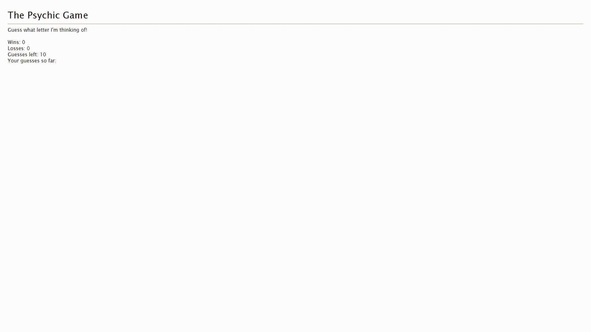

# psychic-game

This is a letter guessing game, where the player types in a letter to guess the randomly generated letter. The player gets ten tries, if the player fails after ten tries the game is lost and a new game will start. Wrong guesses are recorded and vizualized. If the letter is guessed correctly within the ten tries, the player wins. The score updates after each win or loss. 

## Technologies Used

* HTML
* CSS
* Javascript

## Authors

* Alfred Chan